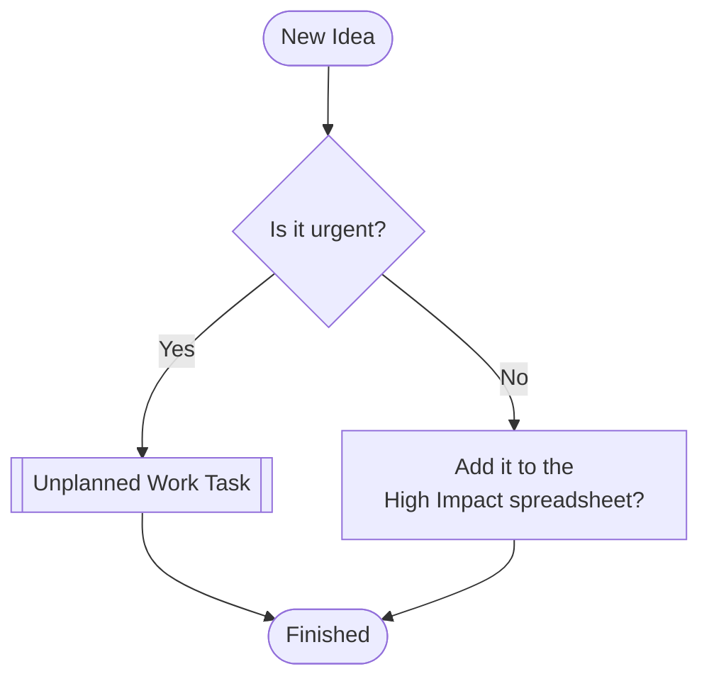

```mermaid
%% you can preview this using cmd+shift+p and mermaid
graph TD
    e1(["New Idea"]) --> d2{"Is it urgent?"}
        d2 --> |"Yes"| p1[["Unplanned Work Task"]]
        d2 --> |"No"| p2["Add it to the \nHigh Impact spreadsheet?"]
    p1 --> e2(["Finished"])
    p2 --> e2
```

