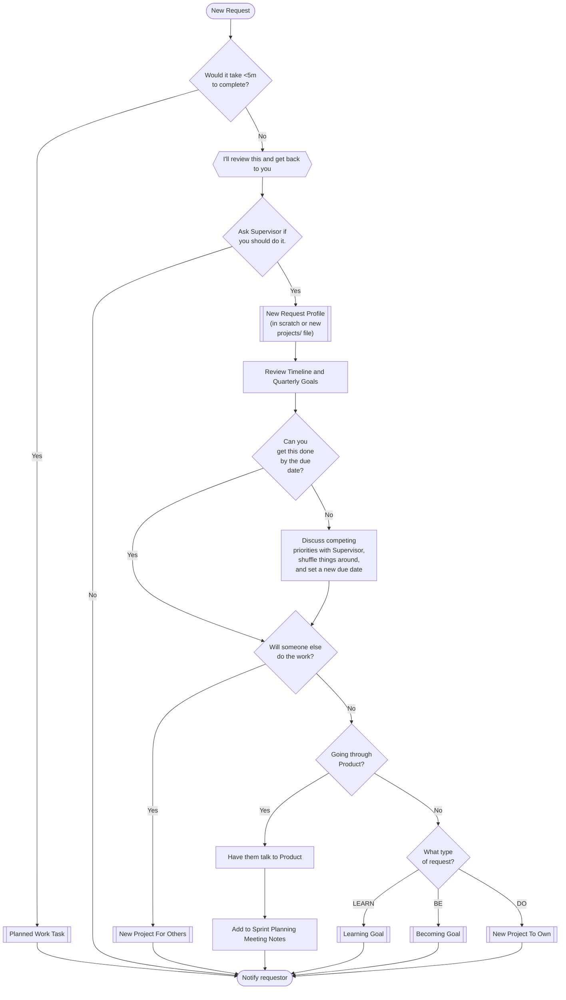

```mermaid
%% you can preview this using cmd+shift+p and mermaid
graph TD
    e1(["New Request"]) -->
        e1d1{"Would it take <5m\nto complete?"}
            e1d1 -- Yes --> e1d1pp1[["Planned Work Task"]] --> e2
            e1d1 -- No --> e1p1
        e1p1{{"I'll review this and get back to you"}} -->
        e1p2{"Ask Supervisor if\n you should do it."}
            e1p2 -- No --> e2
            e1p2 -- Yes -->
                e1p2p1[["New Request Profile\n(in scratch or new\n projects/ file)"]] -->
                e1p2p2["Review Timeline and Quarterly Goals"] -->
                e1p2d1d1{"Can you \nget this done \nby the due \ndate?"}
                    e1p2d1d1 -- Yes --> e1p2d1d1d1
                        e1p2d1d1d1{"Will someone else\ndo the work?"}
                            e1p2d1d1d1 -- Yes -->
                                e1p2d1d1d1pp1[["New Project For Others"]] --> e2
                            e1p2d1d1d1 -- No -->
                                e1p2d1d1d1d1{"Going through \nProduct?"}
                                    e1p2d1d1d1d1 -- Yes -->
                                        e1p2d1d1d1d1p1["Have them talk to Product"] -->
                                        e1p2d1d1d1d1p2["Add to Sprint Planning Meeting Notes"] --> e2
                e1p2d1d1d1d1 -- No -->
                    e1p2d1d1d1d1d1{"What type\nof request?"}
                        e1p2d1d1d1d1d1 -- LEARN --> e1p2d1d1d1d1d1pp1[["Learning Goal"]] --> e2
                        e1p2d1d1d1d1d1 -- BE --> e1p2d1d1d1d1d1pp2[["Becoming Goal"]] --> e2
                        e1p2d1d1d1d1d1 -- DO --> e1p2d1d1d1d1d1pp3[["New Project To Own"]] --> e2
        e1p2d1d1 -- No --> e1p2d1d1p2["Discuss competing\n priorities with Supervisor,\nshuffle things around,\nand set a new due date"] --> e1p2d1d1d1   
    e2(["Notify requestor"])
```